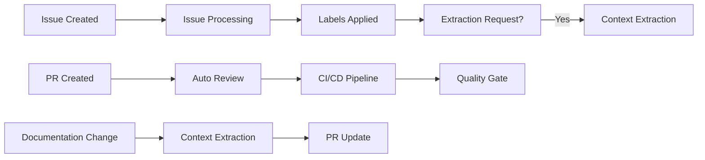

# GitHub Actions Workflows Documentation

## Overview

This directory contains automated workflows for the YAML Context Engineering Agent project. These workflows integrate with Claude Code to provide intelligent automation for various development tasks.

## Workflows

### 1. CI/CD Pipeline (`ci.yml`)

**Trigger**: Push to main/develop, Pull requests, Manual dispatch

**Purpose**: Comprehensive continuous integration and deployment pipeline

**Jobs**:
- **Lint**: Code quality checks (Ruff, Black, MyPy, YAML validation)
- **Test MCP Server**: Unit tests across Python versions
- **Integration Test**: Full system integration testing
- **Security Scan**: Vulnerability scanning with Trivy
- **Build**: Package creation for distribution
- **Documentation**: Auto-generate documentation
- **Release**: Automated releases on tags

**Key Features**:
- Matrix testing across Python 3.9, 3.10, 3.11
- Coverage reporting to Codecov
- Artifact uploading
- Security scanning
- Automated release creation

### 2. Context Extraction (`context-extraction.yml`)

**Trigger**: Issues, PRs, Documentation changes, Manual dispatch

**Purpose**: Automated context extraction from various sources

**Jobs**:
- **Extract from Issue**: Process URLs in issue descriptions
- **Extract from PR**: Update contexts for changed documentation
- **Manual Extraction**: On-demand extraction with custom settings
- **Scheduled Extraction**: Regular updates of tracked sources

**Key Features**:
- Claude-powered URL extraction
- Automatic PR updates
- Scheduled content updates
- Artifact generation

### 3. Automated PR Review (`auto-review.yml`)

**Trigger**: PR opened/updated, @claude mentions

**Purpose**: Intelligent code review using Claude

**Jobs**:
- **Auto Review**: Comprehensive PR analysis
- **Check Slash Commands**: Process PR commands
- **Quality Gate**: Enforce quality standards

**Review Areas**:
- Code quality and standards
- Architecture decisions
- Security concerns
- Documentation completeness
- YAML Context Engineering specifics

**Commands**:
- `/claude test` - Run tests
- `/claude extract` - Extract contexts
- `/claude analyze` - Deep analysis

### 4. Issue Processing (`issue-processing.yml`)

**Trigger**: Issue events, Comments, Schedule

**Purpose**: Intelligent issue management

**Jobs**:
- **Process New Issue**: Auto-categorize and label
- **Handle Extraction Request**: Process extraction requests
- **Respond to Mentions**: Reply to @claude mentions
- **Triage Stale Issues**: Mark inactive issues
- **Create Task from Issue**: Convert issues to tasks

**Features**:
- Automatic labeling
- Priority assignment
- Component identification
- Initial responses
- Stale issue management

## Workflow Interactions



## Configuration

### Required Secrets

```yaml
ANTHROPIC_API_KEY: Your Anthropic API key for Claude
GITHUB_TOKEN: Automatically provided by GitHub
```

### Optional Secrets

```yaml
CODECOV_TOKEN: For coverage reporting
SLACK_WEBHOOK: For notifications
```

## Usage Examples

### Manual Context Extraction

```yaml
# Trigger manual extraction
gh workflow run context-extraction.yml \
  -f urls="https://docs.example.com https://api.example.com" \
  -f granularity="L1_L2_L3"
```

### PR with Claude Commands

```markdown
# In PR description
This PR adds new API endpoints.

/claude test
/claude extract https://api.example.com/v2/docs
/claude analyze performance
```

### Issue Templates

```markdown
<!-- For extraction requests -->
Please extract context from these sources:
- https://docs.example.com/guide
- https://api.example.com/reference

<!-- This will auto-trigger extraction -->
```

## Best Practices

### 1. Workflow Design
- Keep jobs focused and atomic
- Use job dependencies wisely
- Cache dependencies for speed
- Use matrix strategies for coverage

### 2. Claude Integration
- Provide clear, specific prompts
- Include relevant context
- Set appropriate timeout values
- Handle API failures gracefully

### 3. Security
- Never expose secrets in logs
- Use environment protection rules
- Limit permissions to minimum required
- Regular security scanning

### 4. Performance
- Parallelize independent jobs
- Use conditional steps
- Cache build artifacts
- Optimize Docker layers

## Troubleshooting

### Common Issues

#### 1. Claude API Timeout
**Problem**: Claude takes too long to respond
**Solution**: 
- Increase timeout in action
- Break down complex prompts
- Use more specific instructions

#### 2. Workflow Failures
**Problem**: Unexpected workflow failure
**Solution**:
- Check workflow logs
- Verify secrets are set
- Ensure permissions are correct
- Test locally first

#### 3. PR Review Not Triggering
**Problem**: Auto-review doesn't start
**Solution**:
- Check PR labels
- Verify @claude mention format
- Ensure workflow permissions

### Debug Mode

Enable debug logging:
```yaml
env:
  ACTIONS_STEP_DEBUG: true
  ACTIONS_RUNNER_DEBUG: true
```

## Extending Workflows

### Adding New Workflows

1. Create new `.yml` file in `.github/workflows/`
2. Define triggers and jobs
3. Integrate with Claude if needed
4. Add documentation here
5. Test thoroughly

### Custom Claude Actions

```yaml
- name: Custom Claude Task
  uses: anthropics/claude-code-action@beta
  with:
    prompt: |
      Your custom prompt here
      Context: ${{ github.context }}
    anthropic_api_key: ${{ secrets.ANTHROPIC_API_KEY }}
```

## Monitoring

### Workflow Metrics
- Success/failure rates
- Execution times
- API usage
- Cost tracking

### Notifications
- Slack integration
- Email alerts
- GitHub notifications
- Custom webhooks

## Maintenance

### Regular Tasks
- Review workflow performance
- Update dependencies
- Optimize slow jobs
- Archive old artifacts

### Updates
- Monitor Claude API changes
- Update action versions
- Review security advisories
- Benchmark performance

## Related Documentation

- [GitHub Actions Documentation](https://docs.github.com/actions)
- [Claude Code Action](https://github.com/anthropics/claude-code-action)
- [MCP Server Documentation](../../mcp-server/README.md)
- [Main Project README](../../README.md)