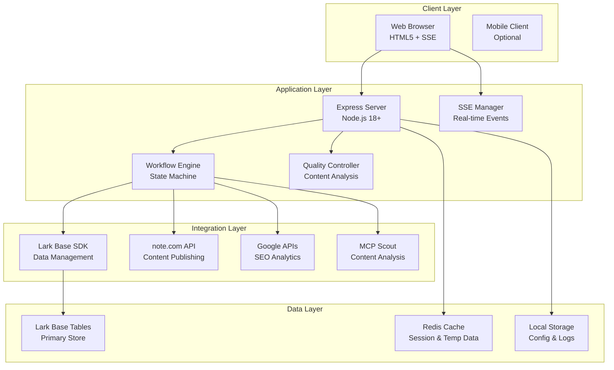
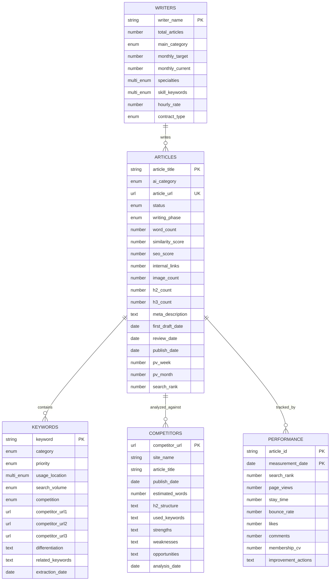
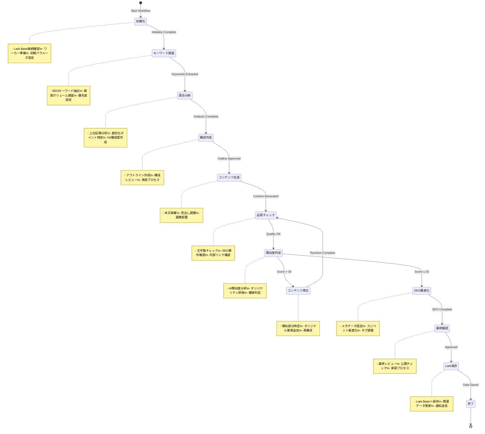
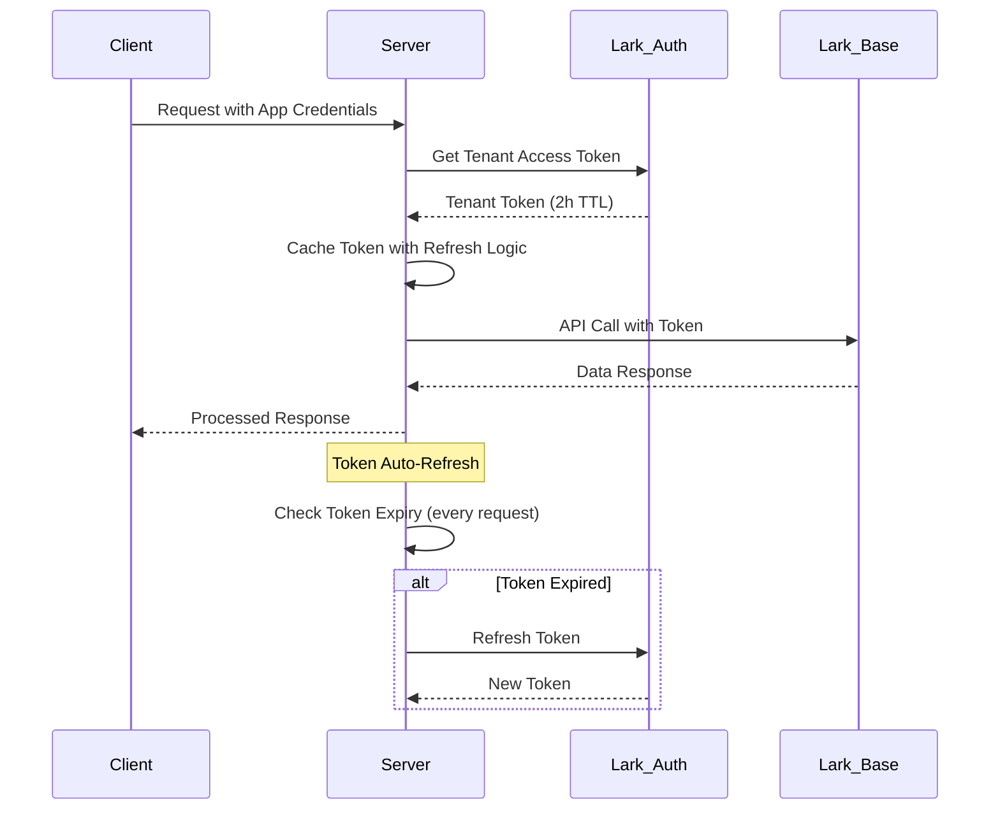

# 🏗️ Lark Base × note.com 記事作成・最適化システム
## 包括的設計・開発・運用ドキュメント v2.0

*最終更新: 2025-08-11*  
*作成者: シュンスケ式システム設計チーム*

---

## 📑 ドキュメント構成

| セクション | 内容 | 対象者 |
|-----------|------|-------|
| [1. 概要・背景](#1-概要背景) | プロジェクト目的とビジョン | 全ステークホルダー |
| [2. システムアーキテクチャ](#2-システムアーキテクチャ) | 技術構成と設計思想 | 開発者・アーキテクト |
| [3. データベース設計](#3-データベース設計) | Lark Base構造とER図 | 開発者・データ管理者 |
| [4. API仕様書](#4-api仕様書) | エンドポイントと通信プロトコル | フロントエンド・統合開発者 |
| [5. ワークフロー設計](#5-ワークフロー設計) | 業務プロセスとステート管理 | 業務担当者・開発者 |
| [6. 実装ガイド](#6-実装ガイド) | セットアップと開発手順 | 開発者・DevOps |
| [7. 運用マニュアル](#7-運用マニュアル) | 日常運用と監視 | 運用チーム |
| [8. テスト戦略](#8-テスト戦略) | 品質保証とテスト手順 | QAエンジニア |
| [9. セキュリティ](#9-セキュリティ) | 認証・認可・データ保護 | セキュリティチーム |
| [10. パフォーマンス](#10-パフォーマンス) | 性能要件と最適化 | インフラエンジニア |

---

## 1. 概要・背景

### 1.1 プロジェクト背景

**解決する課題:**
```yaml
現状の問題:
  - note.com記事作成プロセスの属人化と非効率性
  - SEO最適化作業の複雑性と時間コスト
  - 品質管理の不統一とバラツキ
  - パフォーマンス測定の複雑性
  - チーム協業の可視性不足

目標成果:
  - 作業時間を60%削減
  - 記事品質の統一（類似度スコア30点以下維持）
  - リアルタイムな進捗管理の実現
  - 自動化による人的ミス削減
```

### 1.2 システム価値提案

**🎯 主要価値:**
1. **効率化**: SSEによるリアルタイム進捗管理で作業効率向上
2. **品質向上**: 自動品質チェックによる一定水準の保証
3. **可視化**: Lark Baseによる全プロセスの透明性確保
4. **自動化**: 繰り返し作業の自動化による生産性向上
5. **協業**: チーム全体での情報共有と役割分担の最適化

### 1.3 技術選択理由

| 技術 | 選択理由 | 代替案との比較 |
|------|---------|---------------|
| **Lark Base** | 企業向け協業プラットフォーム、日本語サポート充実 | Notion DB: 統合性で劣る、Airtable: 日本語サポート不足 |
| **SSE** | リアルタイム通信の軽量性、ブラウザ標準サポート | WebSocket: 複雑性増加、Polling: 効率性で劣る |
| **Node.js/Express** | JavaScript統一、豊富なエコシステム | Python: Lark SDKサポート不足、Go: 開発速度で劣る |

---

## 2. システムアーキテクチャ

### 2.1 全体構成図



### 2.2 技術スタック詳細

#### バックエンド
```yaml
Core Framework:
  - Node.js: 18.17.0+
  - Express.js: 4.18.2
  - ES Modules: Native ESM support

Real-time Communication:
  - Server-Sent Events: Native implementation
  - CORS: Cross-origin resource sharing
  - Compression: gzip/brotli

External Integration:
  - "@larksuiteoapi/node-sdk": 1.20.0
  - "uuid": 9.0.1 (Session management)
  - "dotenv": 16.3.1 (Configuration)
```

#### フロントエンド
```yaml
UI Framework:
  - HTML5: Semantic markup
  - CSS3: Modern layout (Grid, Flexbox)
  - JavaScript: ES2022+ features
  - EventSource: SSE client implementation

State Management:
  - Native JavaScript objects
  - LocalStorage: Persistent settings
  - SessionStorage: Temporary data
```

### 2.3 デプロイメントアーキテクチャ

```yaml
Production Environment:
  Platform: Railway/Vercel
  Domain: workflow.ambitiousai.co.jp
  SSL: Let's Encrypt (Auto-renewal)
  CDN: Cloudflare
  Monitoring: Built-in health checks
  
Development Environment:
  Local: localhost:3001
  Hot Reload: nodemon
  Debug: Node.js Inspector
  
Staging Environment:
  Platform: Railway Staging
  Domain: staging-workflow.ambitiousai.co.jp
  Purpose: Integration testing
```

---

## 3. データベース設計

### 3.1 Lark Base ER図



### 3.2 テーブル仕様詳細

#### 3.2.1 記事投稿記録_拡張版 (Articles Master)
**Table ID**: `tbl6Lcel9u6C1N3A`
**プライマリーキー**: 記事タイトル

| フィールド名 | 型 | 制約 | 説明 | バリデーション |
|------------|-----|------|------|---------------|
| 記事タイトル | Text | Required, Unique | 記事のメインタイトル | 1-100文字 |
| AIカテゴリ | SingleSelect | Required | カテゴリ分類 | AI活用/DX/技術解説 |
| 記事URL | URL | Unique | note.com URL | https://note.com/* |
| ステータス | SingleSelect | Required | 作業状態 | 新規/確認中/完了 |
| 執筆フェーズ | SingleSelect | Required | 執筆段階 | 調査/執筆/編集/レビュー/公開 |
| 文字数 | Number | ≥0 | 記事の文字数 | 0-50000 |
| 類似度スコア | Number | 0-100 | AI判定スコア | 閾値30以下推奨 |
| SEOスコア | Number | 0-100 | SEO総合評価 | 80以上目標 |
| 内部リンク数 | Number | ≥0 | 内部リンク数 | 3本以上推奨 |
| 画像数 | Number | ≥0 | 使用画像数 | Alt属性必須 |
| H2見出し数 | Number | ≥0 | H2タグ数 | 3個以上推奨 |
| H3見出し数 | Number | ≥0 | H3タグ数 | - |
| メタディスクリプション | Text | Max120文字 | SEO用説明文 | 100-120文字推奨 |

#### 3.2.2 SEOキーワード管理_拡張版 (SEO Keywords Master)
**Table ID**: `tblBryNkDdCXzRu2`
**プライマリーキー**: キーワード

| フィールド名 | 型 | 制約 | 説明 |
|------------|-----|------|------|
| キーワード | Text | Required, Unique | 対象キーワード |
| カテゴリー | SingleSelect | Required | AI/DX/技術 |
| 優先度 | SingleSelect | Required | 最優先/第2/第3/低 |
| 使用場所 | MultiSelect | Required | タイトル/H1/H2/本文 |
| 検索ボリューム | SingleSelect | Required | 高(10000+)/中(1000-10000)/低(<1000) |
| 競合度 | SingleSelect | Required | 高/中/低 |

### 3.3 データ整合性制約

```sql
-- 類似度スコアの警告ルール
WHEN similarity_score > 30 THEN 
  status = 'レビュー必須'

-- SEOスコアの品質基準
WHEN seo_score < 60 THEN
  writing_phase = '最適化必要'

-- 内部リンク最低基準
WHEN internal_links < 3 THEN
  quality_check = 'NG'
```

---

## 4. API仕様書

### 4.1 認証・認可

#### 4.1.1 認証フロー
```yaml
Authentication Type: Bearer Token (Lark Tenant Access Token)
Header Format: Authorization: Bearer {tenant_access_token}
Token Lifecycle: 2 hours (Auto-refresh)
Scope: bitable:read, bitable:write
```

#### 4.1.2 認証エンドポイント
```javascript
POST /api/auth/token
Content-Type: application/json

Request:
{
  "app_id": "cli_xxxxx",
  "app_secret": "xxxxxx"
}

Response:
{
  "tenant_access_token": "t-xxxxx",
  "expires_in": 7200
}
```

### 4.2 RESTful API エンドポイント

#### 4.2.1 ワークフロー管理

**新規ワークフロー開始**
```http
POST /api/workflow/start
Content-Type: application/json
Authorization: Bearer {token}

Request Body:
{
  "topic": "Claude Code導入ガイド",
  "parameters": {
    "style": "professional",
    "length": "medium", 
    "language": "ja",
    "target_keywords": ["claude code", "AI開発", "効率化"],
    "target_audience": "開発者"
  },
  "larkConfig": {
    "userId": "ou_xxxxx",
    "assignedWriter": "ハヤシシュンスケ"
  }
}

Response:
{
  "workflowId": "wf_20250811_001",
  "status": "started",
  "message": "ワークフローを開始しました",
  "estimatedDuration": 1800,
  "larkBase": {
    "appToken": "WaTCbnKSiaJvMcs3cdPjxobKp8C",
    "tableId": "tbl6Lcel9u6C1N3A",
    "recordId": "rec_xxxxx"
  }
}
```

**ワークフロー状態取得**
```http
GET /api/workflow/{workflowId}/status
Authorization: Bearer {token}

Response:
{
  "workflowId": "wf_20250811_001",
  "status": "in_progress",
  "progress": 45,
  "currentStage": "content_generation",
  "stages": {
    "initialization": { "status": "completed", "duration": 30 },
    "research": { "status": "completed", "duration": 600 },
    "outline": { "status": "completed", "duration": 300 },
    "generation": { "status": "in_progress", "duration": 450 },
    "review": { "status": "pending", "duration": null }
  },
  "startTime": "2025-08-11T09:00:00Z",
  "estimatedEndTime": "2025-08-11T09:30:00Z"
}
```

#### 4.2.2 Lark Base操作

**レコード一覧取得**
```http
GET /api/lark/records?pageSize=20&pageToken=xxxxx&filter=status:新規
Authorization: Bearer {token}

Response:
{
  "records": [
    {
      "recordId": "rec_xxxxx",
      "fields": {
        "記事タイトル": "Claude Code導入ガイド",
        "ステータス": "新規",
        "執筆フェーズ": "調査",
        "類似度スコア": 25,
        "SEOスコア": 85
      },
      "createdTime": "2025-08-11T09:00:00Z",
      "lastModifiedTime": "2025-08-11T09:15:00Z"
    }
  ],
  "hasMore": false,
  "pageToken": "xxxxx",
  "total": 1
}
```

**レコード作成**
```http
POST /api/lark/records
Content-Type: application/json
Authorization: Bearer {token}

Request:
{
  "fields": {
    "記事タイトル": "新規記事タイトル",
    "AIカテゴリ": "AI活用",
    "ステータス": "新規",
    "執筆フェーズ": "調査",
    "優先度": "高"
  }
}

Response:
{
  "recordId": "rec_20250811_001",
  "fields": { ... },
  "createdTime": "2025-08-11T09:00:00Z"
}
```

### 4.3 Server-Sent Events (SSE)

**SSE接続**
```http
GET /api/workflow/stream
Accept: text/event-stream
Cache-Control: no-cache
Authorization: Bearer {token}

Response Stream:
event: connected
data: {"connectionId": "conn_xxxxx", "timestamp": "2025-08-11T09:00:00Z"}

event: stage_update
data: {"stage": "research", "progress": 25, "message": "競合記事分析中..."}

event: content_progress 
data: {"type": "outline", "content": "## 1. Claude Codeとは\n### 1.1 概要", "wordCount": 150}

event: stage_complete
data: {"stage": "research", "duration": 600, "results": {"competitorCount": 5, "keywordCount": 12}}

event: heartbeat
data: {"timestamp": "2025-08-11T09:05:00Z", "activeConnections": 3}

event: error
data: {"error": "LARK_API_ERROR", "message": "Lark APIの呼び出しに失敗しました", "code": "E001"}
```

### 4.4 エラーハンドリング

#### HTTP ステータスコード
```yaml
200: OK - 正常処理
201: Created - リソース作成成功
400: Bad Request - リクエストパラメータエラー
401: Unauthorized - 認証エラー
403: Forbidden - 認可エラー
404: Not Found - リソースが存在しない
429: Too Many Requests - レート制限
500: Internal Server Error - サーバーエラー
502: Bad Gateway - 外部API呼び出しエラー
503: Service Unavailable - サービス停止中
```

#### カスタムエラーコード
```javascript
{
  "error": {
    "code": "LARK_AUTH_FAILED",
    "message": "Lark認証に失敗しました。アプリ権限を確認してください。",
    "details": {
      "appId": "cli_xxxxx",
      "requiredScopes": ["bitable:read", "bitable:write"]
    },
    "timestamp": "2025-08-11T09:00:00Z",
    "requestId": "req_xxxxx"
  }
}
```

---

## 5. ワークフロー設計

### 5.1 記事作成ワークフロー



### 5.2 ステージ別処理詳細

#### Stage 1: 初期化 (Initialization)
```yaml
Duration: 30-60秒
Owner: System
Dependencies: 
  - Lark Base connection
  - User authentication
  - Environment configuration

Processing:
  1. ワークフローID生成 (UUID v4)
  2. Lark Base接続確認
  3. 初期レコード作成
  4. パラメータバリデーション
  5. SSE接続開始通知

Success Criteria:
  - Lark Baseアクセス成功
  - 初期レコード作成完了
  - パラメータ妥当性確認

Error Handling:
  - 認証失敗 → 401エラー返却
  - Base接続失敗 → リトライ(3回)
  - タイムアウト → 503エラー返却
```

#### Stage 2: キーワード調査 (Keyword Research)
```yaml
Duration: 5-10分
Owner: Content Analyst (AI)
Dependencies:
  - Google Keyword Planner API (Optional)
  - Competitor analysis data
  - User input keywords

Processing:
  1. メインキーワード抽出
    - Input topicから主要キーワード特定
    - 関連キーワード生成
    - 検索ボリューム推定
  
  2. キーワード分析
    - 競合度評価
    - 優先度ランキング
    - 使用推奨箇所決定
  
  3. Lark Base更新
    - SEOキーワードテーブル更新
    - 関連記事との重複チェック
    - 優先度マトリクス更新

Output:
  - Primary Keywords: 3-5個
  - Secondary Keywords: 8-12個
  - Long-tail Keywords: 15-20個
  - Keyword Strategy: JSON format
```

#### Stage 3: 競合分析 (Competitor Analysis)
```yaml
Duration: 10-15分
Owner: Research Analyst (AI + MCP Scout)
Dependencies:
  - Web crawling capability
  - Content analysis tools
  - SEO analysis tools

Processing:
  1. 競合記事特定
    - 上位10記事の URL 収集
    - サイト権威性評価
    - 公開日・更新日確認
  
  2. コンテンツ分析
    - H2/H3構成分析
    - 文字数・画像数測定
    - キーワード密度計算
    - 内部リンク戦略分析
  
  3. 差別化機会特定
    - カバーできていない角度発見
    - 情報の鮮度ギャップ特定
    - ユーザー体験の改善点特定

Output:
  - Competitor Report: 詳細分析レポート
  - Differentiation Strategy: 差別化戦略
  - Content Gap Analysis: コンテンツギャップ
  - Recommended Approach: 推奨アプローチ
```

### 5.3 品質基準とゲートチェック

#### 類似度判定基準
```yaml
Score Range: 0-100 (Cosine Similarity %)

Quality Levels:
  Excellent (0-20):
    Status: "✅ 優秀"
    Action: "そのまま進行"
    Description: "オリジナリティが非常に高い"
  
  Good (21-30):
    Status: "✅ 良好" 
    Action: "そのまま進行"
    Description: "十分なオリジナリティあり"
  
  Caution (31-50):
    Status: "⚠️ 注意"
    Action: "部分修正推奨"
    Description: "類似部分の見直し必要"
  
  Warning (51-70):
    Status: "⚡ 警告"
    Action: "大幅修正必須"
    Description: "相当な修正が必要"
  
  Critical (71-100):
    Status: "🚫 危険"
    Action: "全面書き直し"
    Description: "公開リスク極大"

Algorithm:
  - TF-IDF vectorization
  - Cosine similarity calculation
  - Semantic similarity (BERT-based)
  - Structure similarity analysis
```

#### SEO品質要件
```yaml
Title Requirements:
  Length: 28-32文字
  Keywords: メインキーワード必須含有
  Format: "キーワード + 価値提供 + 感情訴求"
  Example: "Claude Code完全ガイド｜開発効率を3倍向上させる実践手法"

Meta Description:
  Length: 100-120文字
  Keywords: メイン+サブキーワード含有
  CTA: 行動促進要素含有
  Example: "Claude Codeの導入から実践まで、開発効率を劇的に向上させる手法を実例付きで解説。初心者でも今すぐ始められる設定方法とベストプラクティスを公開中。"

Content Structure:
  H1: 1個 (title)
  H2: 3-8個 (各章タイトル)  
  H3: 8-15個 (詳細セクション)
  Word Count: 2000-8000文字
  Internal Links: 3-8本
  External Links: 2-5本 (権威性の高いサイト)
  Images: 3-10枚 (alt属性100%設定)

SEO Score Calculation:
  Title Optimization: 20点
  Meta Description: 15点
  Header Structure: 20点
  Keyword Density: 15点
  Internal Linking: 15点
  Content Length: 10点
  Image Optimization: 5点
  Total: 100点 (80点以上を目標)
```

---

## 6. 実装ガイド

### 6.1 開発環境セットアップ

#### 前提条件
```bash
# Node.js環境
Node.js: 18.17.0以上
npm: 9.6.0以上
Git: 2.40.0以上

# 必要なアカウント
- Larkアカウント (企業版推奨)
- note.comアカウント (クリエイター向け)
- Googleアカウント (Analytics用)
```

#### プロジェクトセットアップ
```bash
# プロジェクトクローン
git clone https://github.com/your-org/lark-content-workflow.git
cd lark-content-workflow

# 依存関係インストール
npm install

# 環境変数設定
cp .env.example .env
# .envファイルを編集 (後述の環境変数を設定)

# Lark Base初期セットアップ
npm run setup:base

# 開発サーバー起動
npm run dev
```

#### 環境変数設定
```bash
# .env ファイル設定例
# ===================================

# Lark Configuration (必須)
LARK_APP_ID=cli_a8d2fdb1f1f8d02d
LARK_APP_SECRET=V7mzILXEgIaqLwLXtyZstekRJsjRsFfJ  
LARK_BASE_APP_TOKEN=WaTCbnKSiaJvMcs3cdPjxobKp8C

# テーブルID (setup:base実行後に自動生成)
ARTICLES_TABLE_ID=tbl6Lcel9u6C1N3A
KEYWORDS_TABLE_ID=tblBryNkDdCXzRu2
COMPETITORS_TABLE_ID=tbl6Agoi8jnIEJka
PERFORMANCE_TABLE_ID=tblj1iioooENpi3C
WRITERS_TABLE_ID=tbljQt7FRHUxYqQl

# Server Configuration
PORT=3001
NODE_ENV=development
LOG_LEVEL=info

# SSE Configuration
SSE_HEARTBEAT_INTERVAL=30000
SSE_MAX_CONNECTIONS=100
SSE_TIMEOUT=300000

# Content Generation
DEFAULT_CONTENT_LANGUAGE=ja
MAX_CONTENT_LENGTH=10000
WORKFLOW_TIMEOUT=1800000

# External APIs (オプション)
GOOGLE_API_KEY=your_google_api_key
NOTE_COM_API_TOKEN=your_note_api_token

# Security
CORS_ORIGIN=http://localhost:3001,https://workflow.ambitiousai.co.jp
JWT_SECRET=your_jwt_secret_here
```

### 6.2 Larkアプリケーション設定

#### Lark Developer Console設定
```yaml
Step 1: アプリケーション作成
  1. https://open.larksuite.com/ にアクセス
  2. 「アプリを作成」をクリック
  3. 基本情報入力:
     - アプリ名: "Content Workflow System"
     - アプリ説明: "note.com記事作成・最適化ワークフローシステム"
     - アプリタイプ: "企業自建アプリ"

Step 2: 権限設定
  必要な権限:
    - bitable:read: Baseデータ読み取り
    - bitable:write: Baseデータ書き込み  
    - contact:read: ユーザー情報取得
    - im:message: メッセージ送信 (通知用)

Step 3: イベント購読 (オプション)
  - bitable.record.created: レコード作成イベント
  - bitable.record.updated: レコード更新イベント

Step 4: 安全設定
  - IP許可リスト設定
  - リクエスト署名検証有効化
  - HTTPS必須設定
```

#### Lark Base作成
```yaml
Step 1: ベース作成
  1. Lark Baseアプリを開く
  2. 「新規ベース作成」をクリック
  3. ベース名: "Content Workflow Management"
  4. 説明: "記事作成・SEO最適化プロセス管理"

Step 2: 自動テーブル作成
  # スクリプト実行
  npm run setup:base
  
  # または手動実行
  node scripts/setup-lark-base.js

Step 3: アプリトークン取得
  1. ベース設定 > 高级设置 > 开发者选项
  2. アプリトークンをコピー
  3. .envファイルに LARK_BASE_APP_TOKEN として設定
```

### 6.3 デプロイメント

#### Railway デプロイ (推奨)
```yaml
Step 1: Railwayアカウント準備
  1. https://railway.app/ でアカウント作成
  2. GitHubアカウントを連携
  3. プロジェクト作成

Step 2: 環境変数設定
  # Railway Dashboard で設定
  Variables:
    LARK_APP_ID: cli_xxxxx
    LARK_APP_SECRET: xxxxx
    LARK_BASE_APP_TOKEN: xxxxx
    NODE_ENV: production
    PORT: $PORT (Railway自動設定)

Step 3: デプロイ設定
  # railway.json
  {
    "$schema": "https://railway.app/railway.schema.json",
    "build": {
      "builder": "NIXPACKS"
    },
    "deploy": {
      "startCommand": "npm start",
      "healthcheckPath": "/health",
      "healthcheckTimeout": 100,
      "restartPolicyType": "ON_FAILURE",
      "restartPolicyMaxRetries": 10
    }
  }
```

#### Vercel デプロイ (代替)
```yaml
Step 1: vercel.json 設定
  {
    "version": 2,
    "builds": [
      { "src": "src/server.js", "use": "@vercel/node" }
    ],
    "routes": [
      { "src": "/(.*)", "dest": "/src/server.js" }
    ],
    "env": {
      "NODE_ENV": "production"
    }
  }

Step 2: デプロイ実行
  npx vercel --prod
  
  # 環境変数設定
  vercel env add LARK_APP_ID production
  vercel env add LARK_APP_SECRET production
  vercel env add LARK_BASE_APP_TOKEN production
```

### 6.4 開発ワークフロー

#### ブランチ戦略
```bash
# Git Flow ベース
main: 本番環境
develop: 開発統合
feature/*: 新機能開発
hotfix/*: 緊急修正
release/*: リリース準備

# 例: 新機能開発
git checkout develop
git checkout -b feature/seo-optimization
# 開発作業...
git add .
git commit -m "feat: add SEO score calculation"
git push origin feature/seo-optimization
# プルリクエスト作成
```

#### コーディング規約
```javascript
// ESLint + Prettier 設定
// .eslintrc.json
{
  "env": {
    "node": true,
    "es2022": true
  },
  "extends": ["eslint:recommended"],
  "parserOptions": {
    "ecmaVersion": "latest",
    "sourceType": "module"
  },
  "rules": {
    "no-unused-vars": "error",
    "no-console": "warn",
    "prefer-const": "error"
  }
}

// 関数命名規則
// ✅ Good
async function calculateSeoScore(content) { ... }
const getLarkRecords = async () => { ... }

// ❌ Bad  
function calc(data) { ... }
const get_data = () => { ... }

// エラーハンドリング規則
try {
  const result = await larkBaseManager.createRecord(data);
  return { success: true, data: result };
} catch (error) {
  console.error('Record creation failed:', error);
  throw new WorkflowError('LARK_CREATE_FAILED', error.message);
}
```

---

## 7. 運用マニュアル

### 7.1 日常運用手順

#### 毎日の確認項目 (Daily Checklist)
```yaml
Morning Check (9:00):
  - [ ] システム稼働状況確認
    Command: curl -f http://localhost:3001/health
    Expected: HTTP 200, "status": "healthy"
  
  - [ ] Lark Base接続確認  
    Command: npm run test:lark
    Expected: ✅ All connections successful
  
  - [ ] 前日のワークフロー実行結果確認
    Location: Lark Base > パフォーマンストラッキング
    Check: エラー件数、平均処理時間
  
  - [ ] アクティブSSE接続数確認
    Endpoint: GET /api/connections/count
    Alert: 50接続以上で調査

Evening Check (18:00):
  - [ ] 当日処理件数集計
  - [ ] エラーログレビュー  
  - [ ] リソース使用率確認
  - [ ] バックアップ状況確認
```

#### 週次メンテナンス (Weekly Maintenance)
```yaml
Every Monday 2:00 AM:
  Automated Tasks:
    - [ ] ログローテーション
      Command: npm run logs:rotate
      Retention: 30 days
    
    - [ ] パフォーマンスレポート生成
      Command: npm run report:weekly
      Output: reports/weekly_YYYY-MM-DD.json
    
    - [ ] 依存関係更新チェック
      Command: npm audit && npm outdated
      Action: 必要に応じてパッチ適用
    
    - [ ] データベースクリーンアップ
      Action: 古い一時データの削除
      Retention: 90日間

  Manual Tasks:
    - [ ] KPI達成状況レビュー
    - [ ] ユーザーフィードバック分析  
    - [ ] 容量使用量確認
    - [ ] セキュリティアップデート確認
```

### 7.2 監視・アラート設定

#### システム監視項目
```yaml
Infrastructure Metrics:
  CPU Usage:
    Warning: > 70%
    Critical: > 85%
    Duration: 5分間継続
    
  Memory Usage:
    Warning: > 80%
    Critical: > 90%
    Duration: 3分間継続
    
  Disk Usage:
    Warning: > 80%
    Critical: > 90%
    Check: 毎時
    
  Network I/O:
    Warning: > 100MB/s sustained
    Critical: > 200MB/s sustained
    Duration: 2分間継続

Application Metrics:
  Response Time:
    Warning: > 2秒 (平均)
    Critical: > 5秒 (平均)  
    Window: 5分間
    
  Error Rate:
    Warning: > 1%
    Critical: > 5%
    Window: 10分間
    
  SSE Connections:
    Warning: > 80 concurrent
    Critical: > 100 concurrent
    
  Workflow Success Rate:
    Warning: < 95%
    Critical: < 90%
    Window: 1時間
```

#### アラート通知設定
```yaml
Notification Channels:
  Lark Group: "システム運用チーム"
  Email: ops-team@company.com
  SMS: +81-XX-XXXX-XXXX (Critical only)

Alert Routing:
  Infrastructure Issues:
    → Lark + Email
    Escalation: 30分後にSMS
    
  Application Errors:
    → Lark通知
    Escalation: 15分後にEmail
    
  Business Logic Errors:
    → Lark通知のみ
    
  Security Events:
    → Lark + Email + SMS (即座)

Alert Templates:
  Warning:
    "⚠️ [WARNING] {service_name}で異常を検出
    項目: {metric_name}
    現在値: {current_value}
    閾値: {threshold}
    時刻: {timestamp}"
    
  Critical:
    "🚨 [CRITICAL] 緊急対応が必要です
    サービス: {service_name}
    問題: {issue_description}
    影響: {impact_assessment}
    対応者: @channel"
```

### 7.3 トラブルシューティング

#### よくある問題と解決方法

**問題1: SSE接続が頻繁に切れる**
```yaml
症状:
  - クライアントが数分で接続切断
  - "SSE connection lost" エラー
  - ブラウザの開発者ツールでEventSource error

原因:
  - プロキシサーバーのタイムアウト
  - ネットワークの不安定性
  - サーバー側のメモリリーク

解決策:
  1. Heartbeat間隔を短縮:
     SSE_HEARTBEAT_INTERVAL=15000 (15秒)
  
  2. リトライ機能実装:
     ```javascript
     const eventSource = new EventSource('/api/workflow/stream');
     eventSource.onerror = function() {
       setTimeout(() => {
         window.location.reload();
       }, 5000);
     };
     ```
  
  3. プロキシ設定確認:
     nginx.conf に proxy_read_timeout 3600; を追加
```

**問題2: Lark API レート制限エラー**
```yaml
症状:
  - HTTP 429 Too Many Requests
  - "API rate limit exceeded" エラー
  - ワークフロー処理の失敗

原因:
  - API呼び出し頻度が制限を超過
  - 同時リクエストが多すぎる
  - バックオフ処理の不備

解決策:
  1. レート制限対応の実装:
     ```javascript
     const delay = (ms) => new Promise(resolve => setTimeout(resolve, ms));
     
     async function callLarkAPI(apiCall) {
       let retries = 0;
       while (retries < 5) {
         try {
           return await apiCall();
         } catch (error) {
           if (error.code === 429) {
             const backoffTime = Math.pow(2, retries) * 1000;
             await delay(backoffTime);
             retries++;
           } else {
             throw error;
           }
         }
       }
     }
     ```
  
  2. リクエスト制限設定:
     - 最大同時リクエスト: 5件
     - リクエスト間隔: 200ms以上
     - リトライ上限: 5回
```

**問題3: 類似度スコアが異常に高い**
```yaml
症状:
  - 類似度スコア 80-100% が継続
  - オリジナルコンテンツでも高スコア
  - 品質チェックで全て NG判定

原因:
  - 類似度計算アルゴリズムのバグ
  - 比較対象データの問題
  - テンプレート文の過度な影響

解決策:
  1. アルゴリズム調整:
     ```javascript
     // TF-IDFベクトルの正規化
     function calculateSimilarity(text1, text2) {
       const minLength = Math.min(text1.length, text2.length);
       if (minLength < 100) return 0; // 短文は類似度計算しない
       
       // ストップワード除去強化
       const stopWords = ['です', 'ます', 'である', 'ついて', 'において'];
       // ... 計算ロジック
     }
     ```
  
  2. 比較対象の最適化:
     - 同一サイト記事との比較を除外
     - 古い記事 (2年以上) の重み付け削減
     - ジャンル特化の辞書使用
```

### 7.4 パフォーマンス最適化

#### 応答時間改善
```yaml
Current Performance:
  Average Response: 1.2秒
  95th Percentile: 2.8秒
  Workflow Duration: 15-30分

Target Performance:
  Average Response: < 800ms
  95th Percentile: < 2.0秒  
  Workflow Duration: 10-20分

Optimization Strategies:
  1. データベースクエリ最適化:
     - インデックス追加
     - N+1クエリ問題解決
     - 不要なフィールド取得を削除
  
  2. キャッシュ実装:
     - Redis導入 (レスポンス, セッション)
     - CDN使用 (静的ファイル)
     - アプリケーションレベルキャッシュ
  
  3. 非同期処理活用:
     - ワーカープロセス分離
     - キューシステム導入
     - バックグラウンド処理拡張
```

---

## 8. テスト戦略

### 8.1 テスト方針

#### テストピラミッド
```yaml
Test Strategy: "Trophy Testing"
  Unit Tests (60%):
    - 個別関数・メソッドのテスト
    - ビジネスロジック検証
    - エラーハンドリング確認
    Coverage: 80%以上
    
  Integration Tests (30%):
    - API間の連携テスト
    - データフロー検証
    - 外部サービス統合確認
    Coverage: 主要フロー100%
    
  End-to-End Tests (10%):
    - ユーザージャーニー全体
    - ブラウザ自動化テスト
    - 本番環境相当テスト
    Coverage: クリティカルパス100%
```

#### テストツール構成
```yaml
Testing Stack:
  Unit Testing:
    Framework: Jest 29.x
    Mocking: jest.mock()
    Coverage: Jest built-in
    
  Integration Testing:
    Framework: Supertest (HTTP testing)
    Database: Test fixtures
    External APIs: Nock (HTTP mocking)
    
  E2E Testing:
    Framework: Playwright
    Browsers: Chromium, Firefox, Safari
    CI/CD: GitHub Actions

  Load Testing:
    Tool: Artillery.js
    Scenarios: SSE connections, API throughput
    Metrics: RPS, latency, memory usage
```

### 8.2 ユニットテスト

#### テストファイル構成
```bash
tests/
├── unit/
│   ├── services/
│   │   ├── larkBaseManager.test.js
│   │   ├── contentWorkflow.test.js
│   │   └── sseManager.test.js
│   ├── utils/
│   │   ├── similarity.test.js
│   │   └── validation.test.js
│   └── fixtures/
│       ├── lark-responses.json
│       └── sample-content.json
```

#### サンプルテストケース
```javascript
// tests/unit/services/larkBaseManager.test.js
import { jest } from '@jest/globals';
import LarkBaseManager from '../../../src/services/larkBaseManager.js';

describe('LarkBaseManager', () => {
  let larkManager;
  let mockClient;

  beforeEach(() => {
    mockClient = {
      auth: {
        tenantAccessToken: {
          internal: jest.fn()
        }
      },
      bitable: {
        appTableRecord: {
          create: jest.fn(),
          list: jest.fn(),
          update: jest.fn()
        }
      }
    };
    
    larkManager = new LarkBaseManager();
    larkManager.client = mockClient;
  });

  describe('createArticleRecord', () => {
    it('新規記事レコードを正常に作成する', async () => {
      // Arrange
      const articleData = {
        title: 'テスト記事',
        category: 'AI活用',
        status: '新規'
      };
      
      const expectedResponse = {
        code: 0,
        data: {
          record_id: 'rec_test123',
          fields: articleData
        }
      };
      
      mockClient.bitable.appTableRecord.create.mockResolvedValue(expectedResponse);

      // Act
      const result = await larkManager.createArticleRecord(articleData);

      // Assert
      expect(result).toEqual({
        recordId: 'rec_test123',
        fields: articleData
      });
      
      expect(mockClient.bitable.appTableRecord.create).toHaveBeenCalledWith({
        path: {
          app_token: process.env.LARK_BASE_APP_TOKEN,
          table_id: process.env.ARTICLES_TABLE_ID
        },
        data: {
          fields: articleData
        }
      });
    });

    it('APIエラー時に適切なエラーを投げる', async () => {
      // Arrange
      mockClient.bitable.appTableRecord.create.mockResolvedValue({
        code: 400,
        msg: 'Invalid field'
      });

      // Act & Assert
      await expect(
        larkManager.createArticleRecord({ title: 'test' })
      ).rejects.toThrow('Failed to create article record: Invalid field');
    });
  });
});

// tests/unit/utils/similarity.test.js
import { calculateSimilarity, analyzePlagiarism } from '../../../src/utils/similarity.js';

describe('Similarity Utils', () => {
  describe('calculateSimilarity', () => {
    it('全く同じテキストは100%の類似度を返す', () => {
      const text = 'これはテストテキストです。';
      const similarity = calculateSimilarity(text, text);
      expect(similarity).toBe(100);
    });

    it('完全に異なるテキストは低い類似度を返す', () => {
      const text1 = 'プログラミングについて学習する。';
      const text2 = '料理のレシピを紹介します。';
      const similarity = calculateSimilarity(text1, text2);
      expect(similarity).toBeLessThan(20);
    });

    it('部分的に類似するテキストは適度な類似度を返す', () => {
      const text1 = 'Claude Codeは開発効率を向上させるツールです。';
      const text2 = 'Claude Codeを使用することで開発速度が向上します。';
      const similarity = calculateSimilarity(text1, text2);
      expect(similarity).toBeGreaterThan(30);
      expect(similarity).toBeLessThan(70);
    });
  });

  describe('analyzePlagiarism', () => {
    it('類似度30以下は合格判定', () => {
      const analysis = analyzePlagiarism(25);
      expect(analysis.status).toBe('passed');
      expect(analysis.action).toBe('proceed');
    });

    it('類似度70以上は危険判定', () => {
      const analysis = analyzePlagiarism(75);
      expect(analysis.status).toBe('critical');
      expect(analysis.action).toBe('rewrite');
    });
  });
});
```

### 8.3 統合テスト

```javascript
// tests/integration/workflow.test.js
import request from 'supertest';
import app from '../../src/server.js';
import nock from 'nock';

describe('Workflow Integration', () => {
  beforeEach(() => {
    // Lark API モック
    nock('https://open.larksuite.com')
      .post('/open-apis/auth/v3/tenant_access_token/internal/')
      .reply(200, {
        code: 0,
        tenant_access_token: 'test_token',
        expires_in: 7200
      });
      
    nock('https://open.larksuite.com')
      .post(/\/open-apis\/bitable\/v1\/apps\/.*\/tables\/.*\/records/)
      .reply(200, {
        code: 0,
        data: {
          record_id: 'rec_integration_test',
          fields: {}
        }
      });
  });

  afterEach(() => {
    nock.cleanAll();
  });

  it('完全なワークフローが正常に実行される', async () => {
    // Step 1: ワークフロー開始
    const startResponse = await request(app)
      .post('/api/workflow/start')
      .send({
        topic: '統合テスト記事',
        parameters: {
          style: 'professional',
          length: 'medium'
        }
      })
      .expect(200);

    const { workflowId } = startResponse.body;
    expect(workflowId).toBeDefined();

    // Step 2: ステータス確認
    const statusResponse = await request(app)
      .get(`/api/workflow/${workflowId}/status`)
      .expect(200);

    expect(statusResponse.body.status).toBe('started');

    // Step 3: 完了まで待機 (実際のテストでは適切なタイムアウト設定)
    await new Promise(resolve => setTimeout(resolve, 2000));

    // Step 4: 最終ステータス確認
    const finalStatus = await request(app)
      .get(`/api/workflow/${workflowId}/status`)
      .expect(200);

    expect(['completed', 'in_progress']).toContain(finalStatus.body.status);
  }, 30000); // 30秒タイムアウト

  it('SSE接続が正常に確立される', (done) => {
    const EventSource = require('eventsource');
    const eventSource = new EventSource('http://localhost:3001/api/workflow/stream');

    let eventCount = 0;
    const expectedEvents = ['connected', 'heartbeat'];

    eventSource.onmessage = (event) => {
      const data = JSON.parse(event.data);
      expect(expectedEvents).toContain(data.type || event.type);
      
      eventCount++;
      if (eventCount >= 2) {
        eventSource.close();
        done();
      }
    };

    eventSource.onerror = (error) => {
      eventSource.close();
      done(error);
    };
  }, 10000);
});
```

### 8.4 E2Eテスト

```javascript
// tests/e2e/user-workflow.spec.js
import { test, expect } from '@playwright/test';

test.describe('User Workflow E2E', () => {
  test('ユーザーが記事作成ワークフローを完了できる', async ({ page }) => {
    // Step 1: アプリケーションにアクセス
    await page.goto('http://localhost:3001');
    await expect(page).toHaveTitle(/Content Workflow/);

    // Step 2: SSE接続
    await page.click('button:has-text("SSE接続")');
    await expect(page.locator('#connection-status')).toContainText('接続済み');

    // Step 3: ワークフロー設定
    await page.fill('#topic-input', 'E2Eテスト記事: Claude Code活用法');
    await page.selectOption('#style-select', 'professional');
    await page.selectOption('#length-select', 'medium');

    // Step 4: ワークフロー開始
    await page.click('button:has-text("ワークフロー開始")');

    // Step 5: 進捗確認
    const progressBar = page.locator('#progress-bar');
    await expect(progressBar).toBeVisible();

    // Step 6: リアルタイム更新確認
    const stageStatus = page.locator('#current-stage');
    await expect(stageStatus).toContainText('初期化', { timeout: 5000 });
    await expect(stageStatus).toContainText('調査', { timeout: 30000 });

    // Step 7: 完了確認
    await expect(stageStatus).toContainText('完了', { timeout: 300000 }); // 5分

    // Step 8: Lark Baseリンク確認
    const larkLink = page.locator('a:has-text("Lark Baseで表示")');
    await expect(larkLink).toBeVisible();
    await expect(larkLink).toHaveAttribute('href', /base\.larksuite\.com/);
  });

  test('エラー時の適切な表示', async ({ page }) => {
    // ネットワークエラーをシミュレート
    await page.route('**/api/workflow/start', route => 
      route.fulfill({ status: 500, body: 'Server Error' })
    );

    await page.goto('http://localhost:3001');
    await page.click('button:has-text("SSE接続")');
    
    await page.fill('#topic-input', 'エラーテスト');
    await page.click('button:has-text("ワークフロー開始")');

    // エラーメッセージの確認
    const errorMessage = page.locator('.error-message');
    await expect(errorMessage).toBeVisible();
    await expect(errorMessage).toContainText('エラーが発生しました');
  });
});
```

### 8.5 パフォーマンステスト

```yaml
# tests/performance/load-test.yml
config:
  target: 'http://localhost:3001'
  phases:
    - duration: 60
      arrivalRate: 10
      name: "Warm up"
    - duration: 300  
      arrivalRate: 50
      name: "Normal load"
    - duration: 120
      arrivalRate: 100
      name: "High load"

scenarios:
  - name: "SSE Connection Load Test"
    weight: 40
    engine: "ws"
    flow:
      - connect:
          url: "/api/workflow/stream"
          headers:
            Accept: "text/event-stream"
      - think: 30
      - disconnect

  - name: "Workflow API Load Test"  
    weight: 60
    flow:
      - post:
          url: "/api/workflow/start"
          json:
            topic: "Load test article {{ $randomString() }}"
            parameters:
              style: "professional"
              length: "medium"
          capture:
            - json: "$.workflowId"
              as: "workflowId"
      
      - get:
          url: "/api/workflow/{{ workflowId }}/status"
          
      - think: 5

expectations:
  http_response_time:
    p95: 2000  # 95%のリクエストが2秒以内
    p99: 5000  # 99%のリクエストが5秒以内
  http_error_rate:
    lt: 1      # エラー率1%未満
```

---

## 9. セキュリティ

### 9.1 認証・認可設計

#### 認証フロー詳細


#### 権限管理システム
```yaml
Role-Based Access Control (RBAC):
  
  Roles Definition:
    admin:
      permissions: ["*"]
      description: "システム管理者、全機能アクセス"
      users: ["system-admin@company.com"]
      
    editor:
      permissions: ["article:read", "article:write", "workflow:start", "seo:manage"]
      description: "編集者、記事管理・ワークフロー実行"
      users: ["editor-*@company.com"]
      
    writer:
      permissions: ["article:read", "article:write:own", "workflow:view"]
      description: "ライター、自分の記事のみ編集"
      users: ["writer-*@company.com"]
      
    viewer:
      permissions: ["article:read", "dashboard:view"]
      description: "閲覧者、ダッシュボード・記事閲覧のみ"
      users: ["*@company.com"]

  Permission Format: "{resource}:{action}:{scope?}"
  Examples:
    - "article:read": 全記事読み取り
    - "article:write:own": 自分の記事のみ書き込み
    - "workflow:start": ワークフロー開始
    - "seo:manage": SEO設定管理

  Implementation:
    ```javascript
    class PermissionManager {
      checkPermission(user, permission) {
        const userRole = this.getUserRole(user);
        const rolePermissions = this.getRolePermissions(userRole);
        
        return rolePermissions.some(p => 
          p === "*" || this.matchesPermission(p, permission)
        );
      }
      
      matchesPermission(granted, requested) {
        const grantedParts = granted.split(':');
        const requestedParts = requested.split(':');
        
        return grantedParts.every((part, index) => 
          part === "*" || part === requestedParts[index]
        );
      }
    }
    ```
```

### 9.2 データ保護

#### 暗号化実装
```yaml
Encryption Standards:
  
  Data at Rest:
    Algorithm: AES-256-GCM
    Key Management: 環境変数 + HSM (本番)
    Scope: 
      - 機密ファイル
      - ログファイル (個人情報含む)
      - バックアップデータ
    
    Implementation:
      ```javascript
      import crypto from 'crypto';
      
      class DataEncryption {
        constructor() {
          this.algorithm = 'aes-256-gcm';
          this.key = Buffer.from(process.env.ENCRYPTION_KEY, 'hex');
        }
        
        encrypt(text) {
          const iv = crypto.randomBytes(16);
          const cipher = crypto.createCipher(this.algorithm, this.key, iv);
          
          let encrypted = cipher.update(text, 'utf8', 'hex');
          encrypted += cipher.final('hex');
          
          const authTag = cipher.getAuthTag();
          
          return {
            iv: iv.toString('hex'),
            encryptedData: encrypted,
            authTag: authTag.toString('hex')
          };
        }
        
        decrypt(encryptedObj) {
          const decipher = crypto.createDecipher(
            this.algorithm, 
            this.key, 
            Buffer.from(encryptedObj.iv, 'hex')
          );
          
          decipher.setAuthTag(Buffer.from(encryptedObj.authTag, 'hex'));
          
          let decrypted = decipher.update(encryptedObj.encryptedData, 'hex', 'utf8');
          decrypted += decipher.final('utf8');
          
          return decrypted;
        }
      }
      ```

  Data in Transit:
    Protocol: TLS 1.3
    Certificate: Let's Encrypt (Auto-renewal)
    HSTS: max-age=31536000; includeSubDomains
    Certificate Pinning: Production environment
    
  Sensitive Data Handling:
    PII Masking:
      - Logs: Email → e***@***.com
      - API Response: Phone → ***-****-1234
      - Database: Hash + Salt for reversible data
    
    Data Classification:
      - Public: 記事コンテンツ、SEOデータ
      - Internal: ユーザー設定、ワークフロー設定
      - Confidential: アクセストークン、API Key
      - Restricted: 個人情報、認証情報
```

#### セキュアコーディング規約
```javascript
// ❌ 悪い例：機密データの平文ログ出力
console.log('Lark API Response:', apiResponse);

// ✅ 良い例：機密データのマスク処理
console.log('Lark API Response:', this.maskSensitiveData(apiResponse));

// ❌ 悪い例：SQLインジェクション脆弱性
const query = `SELECT * FROM articles WHERE title = '${userInput}'`;

// ✅ 良い例：パラメータ化クエリ使用
const query = 'SELECT * FROM articles WHERE title = ?';
db.query(query, [userInput]);

// ❌ 悪い例：XSS脆弱性
res.send(`<h1>Welcome ${req.query.name}</h1>`);

// ✅ 良い例：入力値のサニタイズ
const sanitizedName = validator.escape(req.query.name);
res.send(`<h1>Welcome ${sanitizedName}</h1>`);

// 機密データマスク関数
function maskSensitiveData(obj) {
  const sensitiveFields = ['token', 'secret', 'password', 'key'];
  const masked = { ...obj };
  
  Object.keys(masked).forEach(key => {
    if (sensitiveFields.some(field => key.toLowerCase().includes(field))) {
      const value = masked[key];
      if (typeof value === 'string' && value.length > 8) {
        masked[key] = value.substring(0, 4) + '*'.repeat(value.length - 8) + value.substring(value.length - 4);
      } else {
        masked[key] = '***MASKED***';
      }
    }
  });
  
  return masked;
}
```

### 9.3 セキュリティ監視

#### セキュリティログ設計
```yaml
Security Event Categories:
  
  Authentication Events:
    - LOGIN_SUCCESS: 成功ログイン
    - LOGIN_FAILURE: 失敗ログイン 
    - TOKEN_REFRESH: トークン更新
    - UNAUTHORIZED_ACCESS: 認証エラー
    
  Authorization Events:
    - PERMISSION_DENIED: 権限不足
    - ROLE_ESCALATION: 権限昇格試行
    - RESOURCE_ACCESS: リソースアクセス
    
  Data Access Events:
    - RECORD_READ: レコード読み取り
    - RECORD_WRITE: レコード書き込み
    - BULK_OPERATION: 一括操作
    - DATA_EXPORT: データエクスポート
    
  System Events:
    - CONFIG_CHANGE: 設定変更
    - ADMIN_ACTION: 管理者操作
    - SUSPICIOUS_ACTIVITY: 異常な活動

Log Format (JSON):
  ```json
  {
    "timestamp": "2025-08-11T09:00:00.000Z",
    "eventType": "UNAUTHORIZED_ACCESS",
    "severity": "HIGH",
    "source": "api-server",
    "user": {
      "id": "unknown",
      "ip": "192.168.1.100",
      "userAgent": "Mozilla/5.0..."
    },
    "resource": {
      "endpoint": "/api/lark/records",
      "method": "POST",
      "tableId": "tbl6Lcel9u6C1N3A"
    },
    "details": {
      "error": "Invalid token",
      "attempts": 3,
      "blocked": true
    },
    "correlation": {
      "requestId": "req_xyz789",
      "sessionId": "ses_abc123"
    }
  }
  ```
```

#### 異常検知ルール
```yaml
Anomaly Detection Rules:
  
  Brute Force Detection:
    Pattern: "5+ failed login attempts from same IP in 5 minutes"
    Action: 
      - Block IP for 1 hour
      - Send alert to security team
      - Log to security incident system
      
  Privilege Escalation Detection:
    Pattern: "User attempting to access resources above their role"
    Action:
      - Deny request
      - Alert security team immediately
      - Require administrator review
      
  Suspicious Data Access:
    Pattern: "Bulk data access outside normal hours"
    Threshold: "> 100 records accessed between 22:00-06:00"
    Action:
      - Flag for review
      - Notify data owner
      - Require justification
      
  API Abuse Detection:
    Pattern: "High request rate from single source"
    Threshold: "> 200 requests/minute from same IP"
    Action:
      - Apply rate limiting
      - Temporary IP blocking
      - Monitor for escalation

Implementation:
  ```javascript
  class SecurityMonitor {
    constructor() {
      this.eventBuffer = new Map(); // IP -> events[]
      this.blockedIPs = new Set();
    }
    
    checkBruteForce(ip, eventType) {
      const now = Date.now();
      const timeWindow = 5 * 60 * 1000; // 5 minutes
      
      if (!this.eventBuffer.has(ip)) {
        this.eventBuffer.set(ip, []);
      }
      
      const events = this.eventBuffer.get(ip);
      // Remove old events
      const recentEvents = events.filter(e => now - e.timestamp < timeWindow);
      
      if (eventType === 'LOGIN_FAILURE') {
        recentEvents.push({ timestamp: now, type: eventType });
        this.eventBuffer.set(ip, recentEvents);
        
        const failureCount = recentEvents.filter(e => e.type === 'LOGIN_FAILURE').length;
        
        if (failureCount >= 5) {
          this.blockIP(ip, '1h');
          this.sendSecurityAlert('BRUTE_FORCE_DETECTED', { ip, attempts: failureCount });
          return true; // Blocked
        }
      }
      
      return false; // Not blocked
    }
    
    blockIP(ip, duration) {
      this.blockedIPs.add(ip);
      setTimeout(() => this.blockedIPs.delete(ip), this.parseDuration(duration));
    }
  }
  ```
```

---

## 10. パフォーマンス

### 10.1 性能要件定義

#### レスポンス時間目標
```yaml
Performance Targets:
  
  API Response Times:
    Health Check (GET /health):
      Target: < 50ms
      Acceptable: < 100ms
      Critical: > 200ms
      
    Workflow Start (POST /api/workflow/start):
      Target: < 500ms
      Acceptable: < 1000ms  
      Critical: > 2000ms
      
    Record Operations:
      GET /api/lark/records: < 300ms
      POST /api/lark/records: < 800ms
      PUT /api/lark/records/:id: < 500ms
      
    SSE Stream (GET /api/workflow/stream):
      Connection Establishment: < 100ms
      Event Delivery Latency: < 50ms
      Heartbeat Interval: 30s
      
  Workflow Performance:
    Total Duration:
      Short Article (< 2000字): 10-15分
      Medium Article (2000-5000字): 15-25分  
      Long Article (> 5000字): 25-40分
      
    Stage Performance:
      初期化: < 30秒
      調査: 3-8分
      構成: 2-5分
      生成: 5-15分 (内容量依存)
      レビュー: 2-4分
      最終化: 1-3分
      
  Concurrent Performance:
    SSE Connections: 100 concurrent (target)
    Active Workflows: 10 parallel (target)
    API Throughput: 500 requests/minute
```

#### システムリソース制限
```yaml
Resource Limits:
  
  Production Environment:
    CPU: 2 vCPUs (4 cores preferred)
    Memory: 2GB RAM (4GB preferred)
    Storage: 20GB SSD (50GB preferred)
    Network: 1Gbps (unlimited bandwidth)
    
  Resource Usage Targets:
    CPU Usage: < 70% average, < 90% peak
    Memory Usage: < 80% average, < 90% peak
    Disk I/O: < 80% capacity
    Network I/O: < 500MB/s sustained
    
  Scaling Triggers:
    CPU > 80% for 5 minutes → Scale up
    Memory > 85% for 3 minutes → Scale up
    Active connections > 80 → Scale horizontally
    Queue length > 20 workflows → Add workers
```

### 10.2 性能最適化戦略

#### アプリケーション最適化
```javascript
// 1. データベースクエリ最適化
class OptimizedLarkBaseManager {
  constructor() {
    this.queryCache = new Map();
    this.batchSize = 50; // Lark API推奨バッチサイズ
  }
  
  // バッチ処理による効率化
  async batchCreateRecords(records) {
    const batches = this.chunkArray(records, this.batchSize);
    const results = [];
    
    for (const batch of batches) {
      const batchResult = await this.client.bitable.appTableRecord.batch_create({
        path: { app_token: this.appToken, table_id: this.tableId },
        data: { records: batch }
      });
      
      results.push(...batchResult.data.records);
      
      // レート制限対応: バッチ間で200ms待機
      await this.delay(200);
    }
    
    return results;
  }
  
  // クエリキャッシュ
  async getCachedRecords(filter, ttl = 300000) { // 5分キャッシュ
    const cacheKey = JSON.stringify(filter);
    const cached = this.queryCache.get(cacheKey);
    
    if (cached && Date.now() - cached.timestamp < ttl) {
      return cached.data;
    }
    
    const data = await this.getRecords(filter);
    this.queryCache.set(cacheKey, {
      data,
      timestamp: Date.now()
    });
    
    return data;
  }
  
  // 必要フィールドのみ取得
  async getRecordsOptimized(filter, fields = []) {
    const params = {
      filter,
      page_size: 100
    };
    
    // 必要なフィールドのみ指定
    if (fields.length > 0) {
      params.field_names = JSON.stringify(fields);
    }
    
    const response = await this.client.bitable.appTableRecord.list({
      path: { app_token: this.appToken, table_id: this.tableId },
      params
    });
    
    return response.data.items;
  }
}

// 2. SSE接続の効率化
class OptimizedSSEManager {
  constructor() {
    this.connections = new Map(); // connectionId -> response object
    this.eventQueue = []; // イベントキュー
    this.batchSize = 10; // バッチ送信サイズ
    this.batchInterval = 100; // 100ms間隔でバッチ送信
    
    this.startBatchProcessor();
  }
  
  // バッチイベント処理
  startBatchProcessor() {
    setInterval(() => {
      if (this.eventQueue.length === 0) return;
      
      const batch = this.eventQueue.splice(0, this.batchSize);
      const groupedEvents = this.groupEventsByConnection(batch);
      
      groupedEvents.forEach((events, connectionId) => {
        const connection = this.connections.get(connectionId);
        if (connection && !connection.destroyed) {
          this.sendBatchedEvents(connection, events);
        }
      });
    }, this.batchInterval);
  }
  
  // イベントのバッチ送信
  sendBatchedEvents(res, events) {
    const batchedData = {
      type: 'batch',
      events: events,
      timestamp: new Date().toISOString()
    };
    
    try {
      res.write(`event: batch\ndata: ${JSON.stringify(batchedData)}\n\n`);
    } catch (error) {
      console.error('Failed to send batched events:', error);
      this.removeConnection(res);
    }
  }
  
  // メモリリーク防止
  cleanupInactiveConnections() {
    const now = Date.now();
    const timeout = 5 * 60 * 1000; // 5分
    
    this.connections.forEach((connection, id) => {
      if (now - connection.lastActivity > timeout) {
        connection.res.end();
        this.connections.delete(id);
      }
    });
  }
}

// 3. ワーカープロセス分離
class WorkflowProcessor {
  constructor() {
    this.workers = [];
    this.maxWorkers = process.env.MAX_WORKERS || 4;
    this.taskQueue = [];
    
    this.initializeWorkers();
  }
  
  initializeWorkers() {
    for (let i = 0; i < this.maxWorkers; i++) {
      const worker = new Worker('./src/workers/content-worker.js');
      worker.on('message', this.handleWorkerMessage.bind(this));
      worker.on('error', this.handleWorkerError.bind(this));
      
      this.workers.push({
        instance: worker,
        busy: false,
        id: i
      });
    }
  }
  
  async processWorkflow(workflowData) {
    return new Promise((resolve, reject) => {
      const availableWorker = this.workers.find(w => !w.busy);
      
      if (!availableWorker) {
        // 全ワーカーが忙しい場合はキューに追加
        this.taskQueue.push({ workflowData, resolve, reject });
        return;
      }
      
      availableWorker.busy = true;
      availableWorker.instance.postMessage({
        type: 'START_WORKFLOW',
        data: workflowData,
        id: Date.now()
      });
      
      // ワーカーからの応答待機
      const messageHandler = (message) => {
        if (message.type === 'WORKFLOW_COMPLETE') {
          availableWorker.busy = false;
          availableWorker.instance.off('message', messageHandler);
          resolve(message.result);
          
          // キューに待機中のタスクがあれば処理
          if (this.taskQueue.length > 0) {
            const nextTask = this.taskQueue.shift();
            this.processWorkflow(nextTask.workflowData)
              .then(nextTask.resolve)
              .catch(nextTask.reject);
          }
        }
      };
      
      availableWorker.instance.on('message', messageHandler);
    });
  }
}
```

#### インフラ最適化
```yaml
Infrastructure Optimization:
  
  1. CDN Configuration:
    Provider: Cloudflare
    Cache Rules:
      - Static Assets: 30 days TTL
      - API Responses (cacheable): 5 minutes TTL
      - HTML Pages: 1 hour TTL
    Compression: Brotli + Gzip
    Minification: HTML, CSS, JS
    
  2. Database Optimization:
    Connection Pooling:
      Min Connections: 5
      Max Connections: 20
      Idle Timeout: 300 seconds
      
    Query Optimization:
      - Index creation on frequently queried fields
      - Prepared statements for repeated queries
      - Connection reuse
      
    Caching Strategy:
      L1 Cache: Application memory (Node.js Map)
      L2 Cache: Redis (distributed cache)
      L3 Cache: CDN (static content)
      
  3. Load Balancing:
    Algorithm: Round Robin with health checks
    Health Check: GET /health every 30 seconds
    Failover: Auto-remove unhealthy instances
    Session Affinity: IP Hash for SSE connections
    
  4. Auto Scaling:
    Metrics:
      - CPU > 75% for 3 minutes → Scale up
      - Memory > 80% for 2 minutes → Scale up  
      - Request rate > 400/min → Scale up
      - Queue depth > 15 workflows → Scale up
      
    Scaling Policy:
      Min Instances: 2
      Max Instances: 10
      Scale Up: +1 instance
      Scale Down: -1 instance (gradual)
      Cool Down: 5 minutes
```

### 10.3 監視・メトリクス

#### パフォーマンス監視
```yaml
Monitoring Stack:
  
  Application Performance Monitoring (APM):
    Tool: New Relic / Datadog / 自製監視
    Metrics:
      - Response time percentiles (P50, P95, P99)
      - Throughput (requests/second)
      - Error rate
      - Apdex score
      
  System Monitoring:
    Tool: Prometheus + Grafana
    Metrics:
      - CPU usage
      - Memory usage  
      - Disk I/O
      - Network I/O
      - Process count
      
  Business Metrics:
    Custom Dashboard:
      - Workflow completion rate
      - Average workflow duration
      - User satisfaction score
      - Content quality metrics
      
  Real-time Alerting:
    Channels: Lark, Email, SMS
    Thresholds:
      - Response time P95 > 2s → Warning
      - Error rate > 1% → Warning
      - Error rate > 5% → Critical
      - CPU > 90% → Critical
```

#### パフォーマンステスト自動化
```javascript
// tests/performance/benchmark.js
import { performance } from 'perf_hooks';
import EventSource from 'eventsource';

class PerformanceBenchmark {
  constructor() {
    this.results = {};
  }
  
  async benchmarkAPIResponse() {
    const iterations = 100;
    const responses = [];
    
    console.log(`Running ${iterations} API response tests...`);
    
    for (let i = 0; i < iterations; i++) {
      const start = performance.now();
      
      try {
        const response = await fetch('http://localhost:3001/api/lark/records');
        const end = performance.now();
        const duration = end - start;
        
        responses.push({
          iteration: i + 1,
          duration: duration,
          status: response.status,
          success: response.ok
        });
      } catch (error) {
        responses.push({
          iteration: i + 1,
          duration: null,
          status: null,
          success: false,
          error: error.message
        });
      }
    }
    
    // 統計計算
    const successfulRequests = responses.filter(r => r.success);
    const durations = successfulRequests.map(r => r.duration);
    
    durations.sort((a, b) => a - b);
    
    this.results.apiResponse = {
      totalRequests: iterations,
      successfulRequests: successfulRequests.length,
      errorRate: ((iterations - successfulRequests.length) / iterations * 100).toFixed(2) + '%',
      averageTime: (durations.reduce((a, b) => a + b, 0) / durations.length).toFixed(2) + 'ms',
      medianTime: durations[Math.floor(durations.length / 2)].toFixed(2) + 'ms',
      p95Time: durations[Math.floor(durations.length * 0.95)].toFixed(2) + 'ms',
      p99Time: durations[Math.floor(durations.length * 0.99)].toFixed(2) + 'ms',
      minTime: Math.min(...durations).toFixed(2) + 'ms',
      maxTime: Math.max(...durations).toFixed(2) + 'ms'
    };
    
    return this.results.apiResponse;
  }
  
  async benchmarkSSEConnections() {
    const concurrentConnections = 50;
    const testDuration = 60000; // 60秒
    const connections = [];
    const metrics = {
      connectionsEstablished: 0,
      connectionsDropped: 0,
      eventsReceived: 0,
      connectionErrors: 0
    };
    
    console.log(`Testing ${concurrentConnections} concurrent SSE connections for ${testDuration/1000}s...`);
    
    // 並行接続作成
    for (let i = 0; i < concurrentConnections; i++) {
      const eventSource = new EventSource('http://localhost:3001/api/workflow/stream');
      
      eventSource.onopen = () => {
        metrics.connectionsEstablished++;
      };
      
      eventSource.onmessage = (event) => {
        metrics.eventsReceived++;
      };
      
      eventSource.onerror = (error) => {
        metrics.connectionErrors++;
      };
      
      connections.push(eventSource);
    }
    
    // 指定時間後に全接続を閉じる
    await new Promise(resolve => {
      setTimeout(() => {
        connections.forEach(conn => {
          try {
            conn.close();
          } catch (error) {
            metrics.connectionsDropped++;
          }
        });
        resolve();
      }, testDuration);
    });
    
    this.results.sseConnections = {
      concurrentConnections,
      testDurationSeconds: testDuration / 1000,
      connectionsEstablished: metrics.connectionsEstablished,
      connectionsDropped: metrics.connectionsDropped,
      connectionErrors: metrics.connectionErrors,
      eventsReceived: metrics.eventsReceived,
      connectionSuccessRate: ((metrics.connectionsEstablished / concurrentConnections) * 100).toFixed(2) + '%',
      averageEventsPerConnection: (metrics.eventsReceived / metrics.connectionsEstablished).toFixed(2)
    };
    
    return this.results.sseConnections;
  }
  
  generateReport() {
    console.log('\n========================================');
    console.log('     PERFORMANCE BENCHMARK REPORT');
    console.log('========================================\n');
    
    if (this.results.apiResponse) {
      console.log('📊 API Response Performance:');
      console.log(`   Total Requests: ${this.results.apiResponse.totalRequests}`);
      console.log(`   Success Rate: ${100 - parseFloat(this.results.apiResponse.errorRate)}%`);
      console.log(`   Average Time: ${this.results.apiResponse.averageTime}`);
      console.log(`   95th Percentile: ${this.results.apiResponse.p95Time}`);
      console.log(`   99th Percentile: ${this.results.apiResponse.p99Time}`);
      console.log('');
    }
    
    if (this.results.sseConnections) {
      console.log('🔌 SSE Connection Performance:');
      console.log(`   Concurrent Connections: ${this.results.sseConnections.concurrentConnections}`);
      console.log(`   Connection Success Rate: ${this.results.sseConnections.connectionSuccessRate}`);
      console.log(`   Events Received: ${this.results.sseConnections.eventsReceived}`);
      console.log(`   Avg Events/Connection: ${this.results.sseConnections.averageEventsPerConnection}`);
      console.log('');
    }
    
    // パフォーマンス判定
    console.log('🎯 Performance Assessment:');
    
    if (this.results.apiResponse) {
      const p95 = parseFloat(this.results.apiResponse.p95Time);
      if (p95 < 500) {
        console.log('   API Response: ✅ EXCELLENT (<500ms)');
      } else if (p95 < 1000) {
        console.log('   API Response: ✅ GOOD (<1000ms)');
      } else if (p95 < 2000) {
        console.log('   API Response: ⚠️  ACCEPTABLE (<2000ms)');
      } else {
        console.log('   API Response: ❌ NEEDS IMPROVEMENT (>2000ms)');
      }
    }
    
    if (this.results.sseConnections) {
      const successRate = parseFloat(this.results.sseConnections.connectionSuccessRate);
      if (successRate > 95) {
        console.log('   SSE Connections: ✅ EXCELLENT (>95%)');
      } else if (successRate > 90) {
        console.log('   SSE Connections: ✅ GOOD (>90%)');
      } else if (successRate > 80) {
        console.log('   SSE Connections: ⚠️  ACCEPTABLE (>80%)');
      } else {
        console.log('   SSE Connections: ❌ NEEDS IMPROVEMENT (<80%)');
      }
    }
    
    console.log('\n========================================');
  }
}

// ベンチマーク実行
async function runBenchmark() {
  const benchmark = new PerformanceBenchmark();
  
  try {
    await benchmark.benchmarkAPIResponse();
    await benchmark.benchmarkSSEConnections();
    benchmark.generateReport();
  } catch (error) {
    console.error('Benchmark failed:', error);
  }
}

// CLI実行
if (process.argv.includes('--run')) {
  runBenchmark();
}

export { PerformanceBenchmark, runBenchmark };
```

---

## 📄 付録・参考資料

### A. 技術参考資料
- [Lark Open Platform Documentation](https://open.larksuite.com/document/)
- [Node.js Performance Best Practices](https://nodejs.org/en/docs/guides/simple-profiling)
- [Server-Sent Events Specification](https://html.spec.whatwg.org/multipage/server-sent-events.html)

### B. 設定ファイルテンプレート
- `.env.example`: 環境変数テンプレート
- `nginx.conf.example`: リバースプロキシ設定
- `docker-compose.yml`: コンテナ開発環境

### C. 運用チェックリスト
- Daily Operations Checklist
- Weekly Maintenance Tasks  
- Incident Response Procedures
- Disaster Recovery Plan

---

**📞 サポート連絡先**
- 開発チーム: dev-team@company.com
- 運用チーム: ops-team@company.com
- セキュリティチーム: security@company.com

**📝 文書管理**
- バージョン: 2.0
- 最終更新: 2025-08-11
- 次回レビュー予定: 2025-09-11
- 承認者: システムアーキテクト、プロダクトオーナー

---

© 2025 Ambitious AI - All Rights Reserved  
*この文書は機密情報を含みます。社外への配布は禁止されています。*