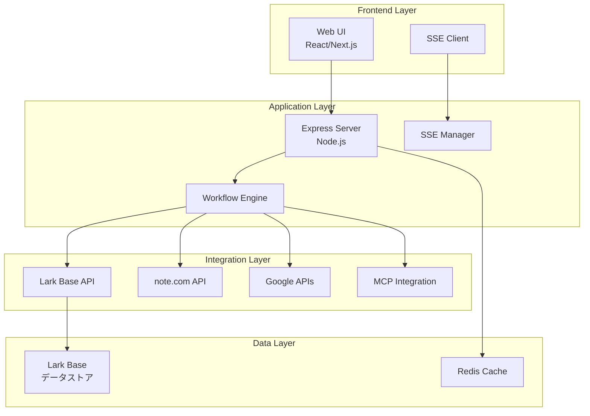
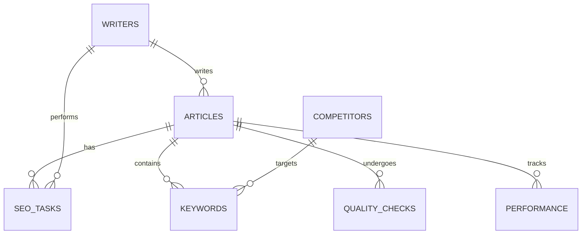
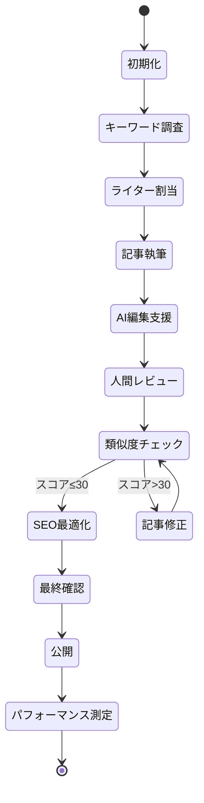
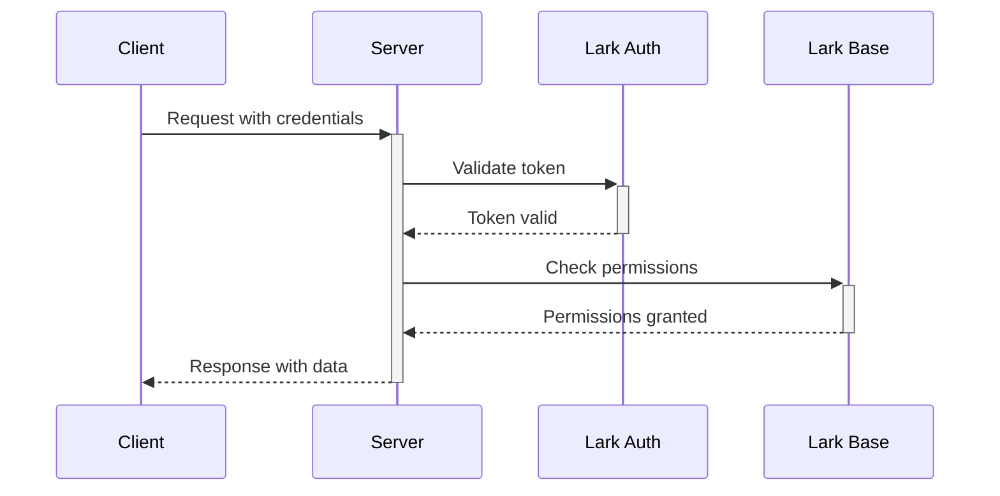

# 📚 Lark Base × note.com 記事作成・最適化システム
## 統合設計書 v1.0

---

## 📋 目次

1. [システム概要](#1-システム概要)
2. [アーキテクチャ設計](#2-アーキテクチャ設計)
3. [データベース設計](#3-データベース設計)
4. [API設計](#4-api設計)
5. [ワークフロー設計](#5-ワークフロー設計)
6. [自動化設計](#6-自動化設計)
7. [セキュリティ設計](#7-セキュリティ設計)
8. [運用設計](#8-運用設計)

---

## 1. システム概要

### 1.1 プロジェクト背景

**課題:**
- note.com記事作成プロセスの属人化
- SEO最適化作業の非効率性
- 品質管理の不統一
- パフォーマンス測定の複雑性

**解決策:**
Lark Baseを中心としたワークフロー管理システムの構築により、記事作成から公開、パフォーマンス測定までを一元管理

### 1.2 システム目的

1. **効率化**: 作業時間を60%削減
2. **品質向上**: 類似度スコア30点以下を維持
3. **可視化**: リアルタイムな進捗管理
4. **自動化**: 繰り返し作業の自動化

### 1.3 スコープ

**含まれるもの:**
- SEOキーワード管理
- 記事作成ワークフロー
- 品質チェックシステム
- パフォーマンストラッキング
- チーム管理

**含まれないもの:**
- 記事の自動生成（人間による執筆が前提）
- 外部SNSへの自動投稿
- 決済システム

---

## 2. アーキテクチャ設計

### 2.1 システム構成図



### 2.2 技術スタック

| レイヤー | 技術 | 用途 |
|---------|------|------|
| フロントエンド | HTML/CSS/JavaScript | Web UI |
| バックエンド | Node.js + Express | APIサーバー |
| リアルタイム通信 | Server-Sent Events | 進捗配信 |
| データベース | Lark Base | データ管理 |
| キャッシュ | Redis (オプション) | パフォーマンス向上 |
| 外部連携 | Lark SDK, Google APIs | API統合 |

### 2.3 デプロイメント構成

```yaml
Production Environment:
  - Server: Vercel/Railway/Heroku
  - Domain: workflow.ambitiousai.co.jp
  - SSL: Let's Encrypt
  - CDN: Cloudflare
  
Development Environment:
  - Local: localhost:3001
  - Staging: staging-workflow.ambitiousai.co.jp
```

---

## 3. データベース設計

### 3.1 ER図



### 3.2 テーブル定義

#### 3.2.1 記事投稿記録_拡張版
**Table ID:** `tbl6Lcel9u6C1N3A`

| フィールド名 | 型 | 説明 | 制約 |
|------------|-----|------|------|
| 記事タイトル | Text | 記事のタイトル | Required |
| AIカテゴリ | Single Select | カテゴリ分類 | AI活用/DX/技術解説 |
| 記事URL | URL | note.com URL | Unique |
| ステータス | Single Select | 作業状態 | 新規/確認中/完了 |
| 執筆フェーズ | Single Select | 執筆段階 | 調査/執筆/編集/レビュー/公開 |
| 文字数 | Number | 記事の文字数 | ≥0 |
| 類似度スコア | Number | AI判定スコア | 0-100 |
| SEOスコア | Number | SEO評価 | 0-100 |
| 内部リンク数 | Number | 内部リンク数 | ≥0 |
| 画像数 | Number | 使用画像数 | ≥0 |
| H2見出し数 | Number | H2タグ数 | ≥0 |
| H3見出し数 | Number | H3タグ数 | ≥0 |
| メタディスクリプション | Text | SEO用説明文 | Max 120文字 |
| 初稿完成日 | Date | 初稿の完成日 | - |
| レビュー完了日 | Date | レビュー完了日 | - |
| 公開予定日 | Date | 公開予定日 | - |
| PV数_1週間 | Number | 週間PV | ≥0 |
| PV数_1ヶ月 | Number | 月間PV | ≥0 |
| 検索順位 | Number | Google順位 | 1-100 |

#### 3.2.2 SEOキーワード管理_拡張版
**Table ID:** `tblBryNkDdCXzRu2`

| フィールド名 | 型 | 説明 | 制約 |
|------------|-----|------|------|
| キーワード | Text | 対象キーワード | Required, Unique |
| カテゴリー | Single Select | 分類 | AI/DX/技術 |
| 優先度 | Single Select | 重要度 | 最優先/第2/第3/低 |
| 使用場所 | Multi Select | 配置箇所 | タイトル/H1/H2/本文 |
| 検索ボリューム | Single Select | 月間検索数 | 高/中/低 |
| 競合度 | Single Select | 競争度 | 高/中/低 |
| 競合記事URL1 | URL | 上位1位 | - |
| 競合記事URL2 | URL | 上位2位 | - |
| 競合記事URL3 | URL | 上位3位 | - |
| 差別化ポイント | Text | 独自性 | - |
| 関連キーワード | Text | 関連語 | - |
| キーワード抽出日 | Date | 調査日 | - |

#### 3.2.3 競合分析マスター
**Table ID:** `tbl6Agoi8jnIEJka`

| フィールド名 | 型 | 説明 |
|------------|-----|------|
| 競合記事URL | URL | 競合URL |
| サイト名 | Text | サイト名称 |
| 記事タイトル | Text | 記事タイトル |
| 公開日 | Date | 公開日時 |
| 推定文字数 | Number | 文字数 |
| H2見出し構成 | Text | 見出し構造 |
| 使用キーワード | Text | キーワード |
| 強み | Text | 強み分析 |
| 弱み | Text | 弱み分析 |
| 差別化機会 | Text | 機会 |
| 分析日 | Date | 分析実施日 |

#### 3.2.4 パフォーマンストラッキング
**Table ID:** `tblj1iioooENpi3C`

| フィールド名 | 型 | 説明 |
|------------|-----|------|
| 記事ID | Text | 記事識別子 |
| 計測日 | Date | 測定日 |
| 検索順位 | Number | Google順位 |
| PV数 | Number | ページビュー |
| 滞在時間 | Number | 平均滞在時間(秒) |
| 直帰率 | Number | 直帰率(%) |
| スキ数 | Number | noteスキ数 |
| コメント数 | Number | コメント数 |
| メンバーシップCV | Number | コンバージョン数 |
| 改善アクション | Text | 改善施策 |

#### 3.2.5 ライター管理CRM_拡張版
**Table ID:** `tbljQt7FRHUxYqQl`

| フィールド名 | 型 | 説明 |
|------------|-----|------|
| ライター名 | Text | 氏名 |
| 投稿記事数 | Number | 累計記事数 |
| 主要カテゴリ | Single Select | 得意分野 |
| 月間投稿目標 | Number | 目標記事数 |
| 今月の投稿数 | Number | 当月実績 |
| 専門分野 | Multi Select | 専門領域 |
| 得意キーワード | Multi Select | 得意KW |
| 時給_記事単価 | Number | 報酬 |
| 契約形態 | Single Select | 雇用形態 |

---

## 4. API設計

### 4.1 RESTful API エンドポイント

#### 4.1.1 ワークフロー管理

```yaml
POST /api/workflow/start
  Description: 新規ワークフロー開始
  Request:
    {
      "topic": "string",
      "parameters": {
        "style": "professional|casual|academic",
        "length": "short|medium|long",
        "language": "ja"
      },
      "larkConfig": {
        "userId": "string"
      }
    }
  Response:
    {
      "workflowId": "string",
      "status": "started",
      "message": "string",
      "larkBase": {
        "appToken": "string",
        "tableId": "string"
      }
    }

GET /api/workflow/:workflowId/status
  Description: ワークフロー状態取得
  Response:
    {
      "workflowId": "string",
      "status": "string",
      "progress": number,
      "currentStage": "string",
      "startTime": "datetime",
      "endTime": "datetime"
    }
```

#### 4.1.2 Lark Base操作

```yaml
GET /api/lark/records
  Description: レコード一覧取得
  Query Parameters:
    - pageSize: number (default: 20)
    - pageToken: string
  Response:
    {
      "records": [],
      "hasMore": boolean,
      "pageToken": "string",
      "total": number
    }

POST /api/lark/records
  Description: レコード作成
  Request:
    {
      "fields": {
        "field_name": "value"
      }
    }
  Response:
    {
      "recordId": "string",
      "fields": {}
    }

PUT /api/lark/records/:recordId
  Description: レコード更新
  Request:
    {
      "fields": {
        "field_name": "value"
      }
    }
```

#### 4.1.3 SSE ストリーム

```yaml
GET /api/workflow/stream
  Description: Server-Sent Eventsストリーム
  Event Types:
    - connected: 接続確立
    - stage_update: ステージ更新
    - stage_data: ステージデータ
    - content_progress: 進捗更新
    - heartbeat: 生存確認
    - error: エラー通知
```

### 4.2 認証・認可

```yaml
Authentication:
  Type: Bearer Token
  Header: Authorization: Bearer {lark_access_token}
  
Rate Limiting:
  - Default: 100 requests/minute
  - Burst: 200 requests/minute
  
CORS:
  - Allowed Origins: ["https://note.ambitiousai.co.jp", "http://localhost:3001"]
  - Allowed Methods: ["GET", "POST", "PUT", "DELETE"]
```

---

## 5. ワークフロー設計

### 5.1 記事作成フロー



### 5.2 ステージ定義

| ステージ | 説明 | 所要時間 | 担当 |
|---------|------|----------|------|
| 初期化 | ワークフロー開始、環境準備 | 1分 | システム |
| 調査 | キーワード調査、競合分析 | 30分 | ライター |
| 構成 | 記事アウトライン作成 | 20分 | ライター |
| 生成 | コンテンツ執筆 | 60-120分 | ライター |
| レビュー | 品質チェック、校正 | 30分 | 編集者 |
| 最終化 | SEO最適化、メタデータ設定 | 15分 | システム |
| 完了 | 公開処理、通知 | 5分 | システム |

### 5.3 品質基準

#### 5.3.1 類似度判定基準

| スコア | 判定 | アクション |
|--------|------|------------|
| 0-30 | ✅ 安全 | そのまま進行 |
| 31-50 | ⚠️ 注意 | 部分修正推奨 |
| 51-70 | ⚡ 警告 | 大幅修正必須 |
| 71-100 | 🚫 危険 | 全面書き直し |

#### 5.3.2 SEO要件

- タイトル: 32文字以内、メインKW含有
- メタディスクリプション: 100-120文字
- H2見出し: 3個以上、KW含有率50%以上
- 内部リンク: 3本以上
- 画像alt属性: 100%設定

---

## 6. 自動化設計

### 6.1 自動化タスク一覧

| タスク | トリガー | 頻度 | 処理内容 |
|--------|----------|------|----------|
| SEOデータ更新 | Cron | 毎日9:00 | GSC/GA4データ取得 |
| 類似度チェック | 記事保存時 | イベント駆動 | AI判定実行 |
| 品質スコア計算 | レビュー完了時 | イベント駆動 | スコア算出 |
| アラート送信 | 閾値超過時 | リアルタイム | Lark通知 |
| レポート生成 | Cron | 毎週月曜 | 週次レポート作成 |

### 6.2 自動化フロー例

```javascript
// SEOデータ自動更新
async function autoUpdateSEO() {
  const articles = await larkBase.getActiveArticles();
  
  for (const article of articles) {
    // Google Search Consoleデータ取得
    const gscData = await googleAPI.getSearchConsoleData(article.url);
    
    // Lark Base更新
    await larkBase.updateRecord(article.id, {
      '検索順位': gscData.position,
      'クリック数': gscData.clicks,
      '表示回数': gscData.impressions,
      'CTR': gscData.ctr,
      '更新日時': new Date()
    });
    
    // 順位低下アラート
    if (gscData.position > article.previousPosition + 5) {
      await sendAlert({
        type: 'RANKING_DROP',
        article: article.title,
        change: gscData.position - article.previousPosition
      });
    }
  }
}
```

### 6.3 通知設定

```yaml
Notification Rules:
  期限リマインド:
    Condition: 公開予定日 - 1日
    Recipients: [担当ライター]
    Channel: Lark Message
    
  類似度アラート:
    Condition: 類似度スコア > 50
    Recipients: [編集責任者]
    Channel: Lark + Email
    Priority: High
    
  目標達成通知:
    Condition: 月間目標達成率 >= 100%
    Recipients: [全チーム]
    Channel: Lark Group
    
  エラー通知:
    Condition: システムエラー発生
    Recipients: [システム管理者]
    Channel: Lark + SMS
    Priority: Critical
```

---

## 7. セキュリティ設計

### 7.1 認証・認可

#### 7.1.1 ロールベースアクセス制御（RBAC）

| ロール | 権限レベル | アクセス可能機能 |
|--------|------------|------------------|
| 管理者 | Full | 全機能 |
| 編集長 | Write | 記事承認、公開、レポート |
| ライター | Limited Write | 自分の記事のみ編集 |
| レビュアー | Read + Comment | 閲覧、コメント |
| 閲覧者 | Read Only | 閲覧のみ |

#### 7.1.2 API認証フロー



### 7.2 データ保護

```yaml
Encryption:
  At Rest: AES-256-GCM
  In Transit: TLS 1.3
  
Sensitive Data:
  - API Keys: Environment variables
  - User Tokens: Encrypted storage
  - Personal Info: Masked in logs
  
Backup:
  Frequency: Daily
  Retention: 30 days
  Location: Encrypted cloud storage
```

### 7.3 監査ログ

```javascript
// 監査ログ記録
function auditLog(action) {
  return {
    timestamp: new Date(),
    userId: action.user.id,
    userName: action.user.name,
    action: action.type,
    resource: action.resource,
    changes: action.changes,
    ipAddress: action.ip,
    userAgent: action.userAgent,
    result: action.success ? 'SUCCESS' : 'FAILURE'
  };
}
```

---

## 8. 運用設計

### 8.1 環境構成

| 環境 | 用途 | URL | 更新頻度 |
|------|------|-----|----------|
| Production | 本番環境 | workflow.ambitiousai.co.jp | 週1回 |
| Staging | 検証環境 | staging-workflow.ambitiousai.co.jp | 日次 |
| Development | 開発環境 | localhost:3001 | 随時 |

### 8.2 監視項目

```yaml
System Monitoring:
  Server:
    - CPU使用率: < 80%
    - メモリ使用率: < 70%
    - ディスク使用率: < 85%
    
  Application:
    - レスポンスタイム: < 2秒
    - エラー率: < 1%
    - 同時接続数: < 100
    
  Business:
    - 日次アクティブユーザー: > 10
    - ワークフロー完了率: > 90%
    - 平均処理時間: < 30分
```

### 8.3 バックアップ・リカバリ

```yaml
Backup Strategy:
  Lark Base:
    Type: Automatic
    Frequency: Daily 02:00 JST
    Retention: 30 days
    
  Application Data:
    Type: Incremental
    Frequency: Every 6 hours
    Retention: 7 days
    
Recovery Procedures:
  RTO: 4 hours
  RPO: 1 hour
  
  Steps:
    1. Identify failure point
    2. Restore from latest backup
    3. Verify data integrity
    4. Resume operations
    5. Post-mortem analysis
```

### 8.4 メンテナンス計画

| タイプ | 頻度 | 実施時間 | 内容 |
|--------|------|----------|------|
| 定期メンテナンス | 月1回 | 第1日曜 02:00-04:00 | システム更新、パッチ適用 |
| 緊急メンテナンス | 必要時 | - | セキュリティ修正 |
| データクリーンアップ | 四半期 | - | 古いデータのアーカイブ |

---

## 📊 付録A: KPI定義

### A.1 システムKPI

| KPI | 目標値 | 測定方法 | 頻度 |
|-----|--------|----------|------|
| システム稼働率 | 99.9% | Uptime監視 | リアルタイム |
| 平均レスポンス時間 | <1秒 | APM | リアルタイム |
| エラー率 | <0.1% | ログ分析 | 時間毎 |

### A.2 ビジネスKPI

| KPI | 目標値 | 測定方法 | 頻度 |
|-----|--------|----------|------|
| 記事公開数 | 30本/月 | Lark Base集計 | 日次 |
| 平均SEOスコア | 80点 | 自動計算 | 記事毎 |
| 類似度合格率 | 95% | 自動判定 | 記事毎 |
| 作業時間削減率 | 60% | タイムトラッキング | 月次 |

---

## 📚 付録B: トラブルシューティング

### B.1 よくある問題と対処法

| 問題 | 原因 | 対処法 |
|------|------|--------|
| SSE接続が切れる | タイムアウト | Heartbeat間隔を短縮 |
| Lark API エラー | レート制限 | リトライ処理実装 |
| 類似度スコアが高い | コンテンツ重複 | 独自要素を追加 |
| パフォーマンス低下 | キャッシュ未使用 | Redis導入 |

### B.2 エラーコード一覧

| コード | 説明 | 対処法 |
|--------|------|--------|
| E001 | Lark認証失敗 | トークン更新 |
| E002 | データ不整合 | データ検証実行 |
| E003 | ワークフロータイムアウト | タスク分割 |
| E004 | 容量制限超過 | データアーカイブ |

---

## 📝 改訂履歴

| バージョン | 日付 | 変更内容 | 作成者 |
|-----------|------|----------|--------|
| 1.0 | 2025-01-11 | 初版作成 | システム設計チーム |

---

**© 2025 Ambitious AI - All Rights Reserved**